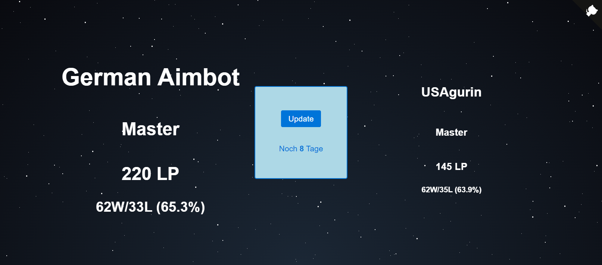

# LeagueClimbChallenge

A small project to get an better and ad-free update on the status of a league climbing challenge.

## Libraries
 * CSS: [github.com/franciscop/picnic](https://github.com/franciscop/picnic)
 * Loading: [lukehaas css-loaders](https://projects.lukehaas.me/css-loaders/)
 * Github-Corner: [github.com/YunYouJun/wc-github-corners](https://github.com/YunYouJun/wc-github-corners)
 * Background: [CodePen by Saransh Sinha](https://codepen.io/saransh/pen/BKJun)
 * Alerts: [alertifyjs](https://alertifyjs.com/)
 * Middelware: [github.com/senchalabs/connect](https://github.com/senchalabs/connect)
 * Local Secrets: [github.com/motdotla/dotenv](https://github.com/motdotla/dotenv)